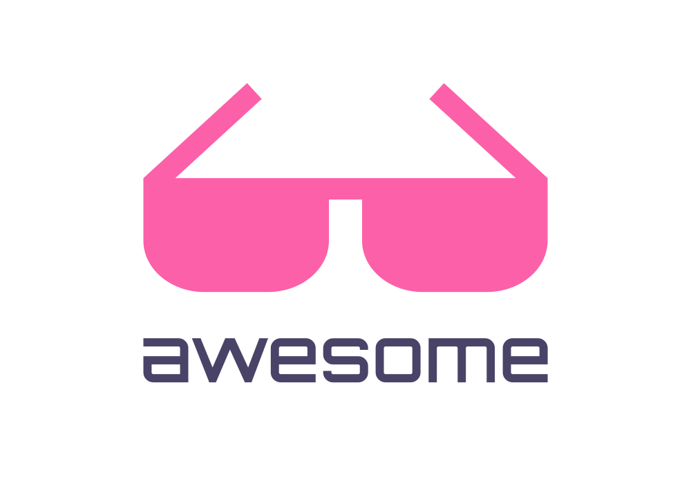

   
    
   
   
   

## Awesome Research Software Engineering Infrastructure 

> Work in progress collaborative effort to define use cases and tooling for research software engineering infrastructure.

Please edit or do pull requests to this repository to contribute!

**under development**

## Discussion

 - [Use Cases](docs/use-cases.md): Are there repeated or typical use cases for cloud apps in RSEng work?
 - [Goals](docs/goals.md): Potential goals for this resource.  

## License

