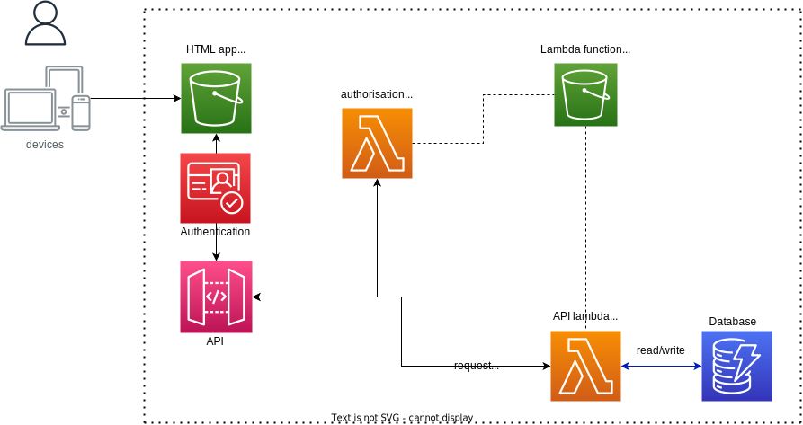

# Web and Mobile Apps at University College London 
provided by Peter Schmidt

## Web and Mobile Apps
I work in the Research Software Development Group at UCL, which provides a consultancy service for research teams. 
Frequently, we get requests for web and/or mobile applications with the following characteristics:
- user roles and management: typically, these apps require users to be registered and logged in in order to use the feature sets. Users are categorised into different roles. For example: research user (who analyses data), user (who provides data), admin (who can manipulate the app settings and configs). 
- data collection: the apps collect data for research either directly from users (surveys) or indirectly (monitoring app actions and navigations). 
- data storage: collected data and analysed, processed data are stored in a database
- analytical features: research users want to visualise and analyse collected data. They may also wish to steer the way in which the app is being used (e.g. turning on and off certain features, or presenting specific questions)

### Architectural design
At UCL we aim to provide a set of design patterns for this type of app. 

At the most basic level, 3 main elements can be identified:
- API layer: clients (web/mobile apps) interact with a central, cloud-based application service through a set of defined API calls (REST or HTML)
- Data storage e.g. a SQL DB such as PostgreSQL or a non-SQL DB such as DynamoDB (AWS). 
- functions to interact between API layer and DB. In case of a simple read/write this could be facilitated by serverless functions

#### Serverless App Model
At UCL we use AWS and Azure as cloud providers. The following diagram is an elementary implementation of a web app based on serverless architecture. It is for AWS and based on a single environment and availability zone.

